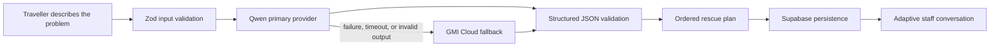

# Moshi Help — Japan Rescue Companion

**Know what to do. Know what to say.**

[Live demo](https://moshi-moshi-bay.vercel.app/) ·
[Pitch deck](./pitch-deck/moshi-help-pitch-deck.pdf)

Moshi Help, branded as **moshi** in the application, is a mobile-first AI
rescue companion for first-time and solo travellers in Japan. It helps a
traveller move from language anxiety to a practical plan when an unexpected
problem happens at a station, hotel, locker, or another unfamiliar place.

Instead of returning only a translated sentence, Moshi explains:

- what may be happening;
- what to do first and why;
- which official person or desk to approach;
- what information to prepare;
- what to say in polite Japanese;
- what staff may ask next;
- how to continue the conversation.

> Translation handles words. Moshi helps the traveller handle the situation.

## The problem

Travel problems become harder when the traveller faces two unfamiliar systems
at once:

1. they do not know the local procedure;
2. they do not know how to communicate within that procedure.

A traveller may be able to translate “I lost my card,” but still not know
whether to find station staff, the locker operator, or another official helper.
They may not know which details prove ownership, what questions staff will ask,
or how to reply after the first sentence.

This is especially stressful for first-time and solo travellers, who cannot
always rely on a companion to interpret the situation.

## The solution

Moshi turns a free-form description into a structured rescue plan. The user
receives ordered actions, a recommended official helper, a preparation
checklist, and Japanese communication that can be copied or shown directly to
staff.

The conversation does not stop after the opening message. A traveller can type
or paste what a staff member said—in Japanese, romaji, or an English
description—and Moshi prepares the next practical action and reply.

The goal is not to replace local staff. It is to help the traveller approach
the right person with clearer context and greater confidence.

## Current MVP

### Supported situations

- Locker, lost-item, luggage, and belongings problems
- Station, train, ticket, route, and transport problems
- Hotel, check-in, booking, reservation, and room problems
- Free-form situations outside the preset categories
- A polished lost-IC-card locker demo

### Traveller experience

- Ordered immediate actions with reasons
- Urgency classification and a clearly stated practical goal
- Identification of the appropriate official helper
- A checklist of information the traveller should prepare
- Polite Japanese messages with readable romaji
- Explanations in English or Simplified Chinese
- Predicted staff questions and adaptable suggested answers
- A full-screen staff handoff view
- Copy-to-clipboard controls for Japanese messages
- Continued conversation guidance based on the latest staff message
- Light and dark themes

### Accounts and saved history

- Email and password registration and login
- Optional email-confirmation callback
- Anonymous guest access when enabled in Supabase
- Private saved rescue plans
- Reopenable conversation history
- Active and resolved status management
- Rescue-plan deletion

Guest sessions use an anonymous Supabase user. Their records remain protected
by the same ownership rules, but cannot be recovered after the guest signs out
or loses the browser session.

## How it works



1. The traveller chooses a category and describes what happened.
2. The server validates the input.
3. Qwen generates a structured plan.
4. The response is parsed and validated with Zod.
5. Invalid JSON or schema output receives one correction attempt.
6. If Qwen fails, times out, or remains invalid, GMI Cloud is called.
7. The validated plan is saved to the authenticated user’s private history.
8. Each staff-message turn uses the saved plan and recent conversation context
   to prepare the next reply.

## AI sponsor integrations

This submission claims two AI Stack Partner integrations.

### [Qwen Cloud](https://www.qwencloud.com/?utm_source=aibuilders) — primary

Qwen is the primary reasoning and generation provider. The application uses an
OpenAI-compatible Qwen endpoint to:

- classify the situation and urgency;
- identify the traveller’s goal and the correct official helper;
- build ordered next actions;
- detect missing information;
- generate Japanese, romaji, and the selected explanation language;
- predict likely staff questions;
- produce the staff handoff card;
- interpret new staff messages and prepare the next reply.

The default project configuration uses:

```dotenv
QWEN_BASE_URL=https://dashscope-intl.aliyuncs.com/compatible-mode/v1
QWEN_MODEL=qwen3.7-plus
QWEN_ENABLE_THINKING=true
```

Implementation:

- `src/lib/ai/qwen-provider.ts`
- `src/lib/ai/provider-core.ts`
- `src/lib/ai/generate.ts`
- `src/lib/ai/prompts.ts`

### [GMI Cloud](https://www.gmicloud.ai/en?utm_source=luma) — fallback

GMI Cloud is the automatic fallback provider. It is called only when the
primary Qwen path fails, times out, or cannot return valid structured output.
The fallback uses the same prompts, schema, and validation contract, so the UI
receives the same response shape.

The default project configuration uses:

```dotenv
GMI_BASE_URL=https://api.gmi-serving.com/v1
GMI_MODEL=Qwen/Qwen3.7-Max
```

Implementation:

- `src/lib/ai/gmi-provider.ts`
- `src/lib/ai/generate.ts`
- `scripts/provider-flow-test.ts`

Provider metadata is stored with every rescue so the application can show
whether Qwen, GMI fallback, or the limited demo fixture produced the plan.

No other AI Stack Partner is claimed as a product integration for this
submission.

## Hackathon alignment

Built for the **Agent Forge AI Hackathon**.

### Theme alignment

Moshi is rooted in travel within Japan. The product focuses on real interactions
with station staff, ticket gates, coin lockers, hotels, reservations, and
Japanese-language service situations.

### Innovation

Moshi combines situation reasoning, procedural guidance, multilingual
communication, and conversation continuation. It goes beyond a one-shot
translator by helping the traveller progress through the whole interaction.

### Real-life problem solving

The product addresses a practical gap: a traveller may know the words for a
problem but still not know the correct process, the correct helper, or the next
reply.

### Sponsored product usage

- Qwen: primary rescue planning and conversation engine
- GMI Cloud: validated automatic fallback path

## Tech stack

| Layer | Technology |
| --- | --- |
| Framework | Next.js 16 App Router |
| UI | React 19, TypeScript 5 |
| Styling | Tailwind CSS 4, custom design tokens, Geist |
| Icons | Lucide React |
| AI client | OpenAI JavaScript SDK with compatible provider endpoints |
| Primary AI | Qwen |
| Fallback AI | GMI Cloud |
| Validation | Zod 4 |
| Authentication | Supabase Auth and Supabase SSR |
| Database | Supabase Postgres |
| Authorization | Row Level Security plus server-side ownership filters |
| Hosting | Vercel |
| Tooling | ESLint 9, TypeScript, tsx |

## Architecture

Moshi uses a single Next.js application rather than a separate frontend and
backend service.

- Server Components read authenticated data.
- Client Components handle forms, copying, theme changes, and interactive
  rescue workspaces.
- Route Handlers perform AI generation and database mutations.
- `src/proxy.ts` refreshes Supabase sessions and redirects unauthenticated
  requests.
- Protected pages and API handlers verify the user again near the data source.
- Provider API keys remain server-only.

### API routes

| Route | Method | Purpose |
| --- | --- | --- |
| `/api/rescue` | `POST` | Validate input, generate a plan, and save it |
| `/api/conversation` | `POST` | Interpret a staff message and save the next turn |
| `/api/rescue/[id]` | `PATCH` | Change a rescue status |
| `/api/rescue/[id]` | `DELETE` | Delete an owned rescue |
| `/auth/callback` | `GET` | Exchange a Supabase email-confirmation code |

Every rescue and conversation mutation requires an authenticated Supabase user.
Queries also filter by `user_id`, while database Row Level Security provides a
second ownership boundary.

## Database and privacy

The SQL migrations create two application tables:

### `public.rescue_sessions`

Stores:

- traveller input and selected explanation language;
- diagnosis and complete rescue plan;
- provider metadata;
- conversation history;
- active, resolved, or archived status;
- created and updated timestamps.

### `public.profiles`

Stores:

- the authenticated user ID;
- optional full name;
- whether the account is a guest;
- created and updated timestamps.

Both tables use Row Level Security. Authenticated users can access only records
associated with their own Supabase user ID. Anonymous Data API access is
revoked.

The application uses the public Supabase URL and anon/publishable key in the
browser. Qwen and GMI credentials are server-only. A Supabase service-role key
is not required by the application.

## Project structure

```text
src/
├── app/
│   ├── (auth)/                 # Login and registration
│   ├── (protected)/            # App, history, and rescue workspace
│   ├── api/                    # Rescue and conversation route handlers
│   ├── auth/callback/          # Supabase confirmation callback
│   └── page.tsx                # Public landing page
├── components/
│   ├── app/                    # Authenticated application header
│   ├── auth/                   # Email/password and guest auth form
│   ├── brand/                  # Moshi logo
│   ├── rescue/                 # Rescue form, plan, and history UI
│   └── theme/                  # Light/dark theme control
├── lib/
│   ├── ai/                     # Providers, prompts, failover, demo fixture
│   ├── schemas/                # Zod request and response contracts
│   ├── supabase/               # Browser, server, and proxy clients
│   └── types/                  # Database-facing TypeScript types
└── proxy.ts                    # Session refresh and route redirects

supabase/migrations/            # Database schema and RLS policies
scripts/                        # Provider and optional environment checks
pitch-deck/                     # Editable hackathon pitch deck and PDF
```

## Run locally

### Requirements

- Node.js 20.9 or newer
- npm
- A Supabase project
- Qwen credentials
- GMI Cloud credentials for fallback coverage

### 1. Install dependencies

```bash
npm install
```

### 2. Configure environment variables

Copy the example:

```bash
cp .env.example .env.local
```

On Windows PowerShell:

```powershell
Copy-Item .env.example .env.local
```

Configure:

```dotenv
# Supabase
NEXT_PUBLIC_SUPABASE_URL=
NEXT_PUBLIC_SUPABASE_ANON_KEY=

# Qwen primary
QWEN_API_KEY=
QWEN_BASE_URL=https://dashscope-intl.aliyuncs.com/compatible-mode/v1
QWEN_MODEL=qwen3.7-plus
QWEN_ENABLE_THINKING=true
QWEN_TIMEOUT_MS=120000

# GMI Cloud fallback
GMI_API_KEY=
GMI_BASE_URL=https://api.gmi-serving.com/v1
GMI_MODEL=Qwen/Qwen3.7-Max

# Application
DEMO_MODE=false
NEXT_PUBLIC_SITE_URL=http://localhost:3000
```

Development-only provider controls are also available:

```dotenv
FORCE_AI_PROVIDER=auto
SIMULATE_QWEN_FAILURE=false
```

`FORCE_AI_PROVIDER` may be `auto`, `qwen`, or `gmi`. Non-auto overrides are
rejected in production. `SIMULATE_QWEN_FAILURE` works only outside production
and exists to verify the automatic fallback path.

### 3. Apply Supabase migrations

Run these files in order through the Supabase SQL editor or migration tooling:

```text
supabase/migrations/001_initial_schema.sql
supabase/migrations/002_profiles_and_guest.sql
supabase/migrations/003_explanation_language.sql
```

In Supabase Auth:

1. Enable Email/Password authentication.
2. Enable anonymous sign-ins if guest access should be available.
3. Add `http://localhost:3000/auth/callback` to the allowed redirect URLs when
   email confirmation is enabled.

For a fast hackathon demo, email confirmation may be disabled. For production,
configure a custom SMTP provider rather than relying on Supabase’s limited
default sender.

### 4. Start the app

```bash
npm run dev
```

Open [http://localhost:3000](http://localhost:3000).

## How to use Moshi

1. Create an account, sign in, or continue as a guest.
2. Choose **Locker or belongings**, **Station or transport**,
   **Hotel or reservation**, or **Another situation**.
3. Choose English or Simplified Chinese for explanations.
4. Describe what happened.
5. Optionally add the location and facts already known.
6. Select **Help me handle this**.
7. Follow the ordered actions and preparation checklist.
8. Copy or open the Japanese message full-screen for local staff.
9. Enter what the staff member said to prepare the next reply.
10. Reopen, resolve, or delete the rescue from the history screen.

The preset lost-IC-card case can be loaded from the main rescue form for a
consistent demonstration.

## Deterministic demo fixture

When `DEMO_MODE=true`, the specific lost-IC-card locker demo may use a
deterministic plan only after both Qwen and GMI fail.

This fixture:

- is limited to the matching locker scenario;
- supports English and Simplified Chinese explanations;
- does not provide mock output for arbitrary situations;
- is recorded with `fixtureUsed: true`;
- is not presented as a successful live provider response.

Keep `DEMO_MODE=false` when the fixture is not required.

## Verification

Run the application checks:

```bash
npm run lint
npm run typecheck
npm run build
```

Or run all three:

```bash
npm run check
```

Test Qwen with English and Simplified Chinese rescue and conversation flows:

```bash
npm run test:qwen
```

Verify Qwen, direct GMI, and simulated Qwen-to-GMI fallback paths:

```bash
npm run test:providers
```

An optional Daytona sandbox smoke-test script also exists for development
verification. It is not claimed as a product sponsor integration in this
submission.

```bash
npm run test:daytona
```

## Deployment

Production deployment:

**[https://moshi-moshi-bay.vercel.app/](https://moshi-moshi-bay.vercel.app/)**

### Deploy to Vercel

1. Import the repository into Vercel.
2. Add the Supabase, Qwen, GMI, demo-mode, and site-URL environment variables.
3. Set `NEXT_PUBLIC_SITE_URL` to the production origin.
4. Apply all Supabase migrations.
5. Add `https://YOUR_DOMAIN/auth/callback` to Supabase Auth redirect URLs.
6. Deploy. Vercel detects the Next.js application automatically.

Do not expose `QWEN_API_KEY` or `GMI_API_KEY` through a
`NEXT_PUBLIC_` variable.

## Safety and limitations

Moshi is a travel guidance tool, not an emergency service, legal advisor,
medical provider, station operator, hotel, or guarantee of recovery.

The prompts explicitly instruct the models to:

- distinguish facts from assumptions;
- state uncertainty instead of guessing;
- avoid inventing phone numbers, fees, opening hours, policies, or laws;
- avoid guaranteeing an outcome;
- direct the traveller to official staff;
- tell the traveller to move to safety and seek emergency or official help
  when immediate danger is present.

Model output can still be wrong or incomplete. Travellers should confirm
important procedures with official staff and avoid sharing passports, payment
details, or other sensitive information with unofficial helpers.

The current MVP accepts typed input. It does **not** currently include maps,
OCR, voice input, automated calls, native mobile features, or offline rescue
plans.

## Roadmap

- Speech input and read-aloud Japanese after privacy review
- On-device OCR for signs, tickets, and forms
- Curated source-linked procedure packs for common operators
- Offline access to saved staff handoff cards
- Additional traveller explanation languages
- Structured resolution feedback to improve rescue planning

## Creator

Created for the **Agent Forge AI Hackathon**.


