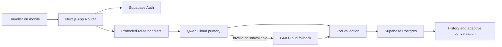

# Moshi — Japan Rescue Companion

**From language panic to the next clear step.**

Moshi is a mobile-first, situation-aware rescue companion for travellers in
Japan. It turns an unfamiliar problem into an ordered plan: what is happening,
what to do now, who to approach, what to prepare, what to say in Japanese, what
staff may ask, and how to continue the conversation.

> **Translation tools translate words. Moshi understands the situation,
> prepares the traveller, and guides the conversation towards resolution.**

## Founder story

The idea comes from a specific travel failure: luggage was stored in a Japanese
station locker using an IC transport card, then the card was lost. A sentence
translator could express “I lost my card,” but it could not explain which staff
member to find, which details would prove ownership, what the locker operator
might need, or how the conversation would change after the first sentence.

Moshi is built for that gap between translating a phrase and actually resolving
a stressful situation.

## The user pain

First-time visitors often face two problems at once:

- the procedure is unfamiliar;
- the language needed to navigate that procedure is unfamiliar.

Stress makes it harder to decide what matters. A traveller may not know whether
to approach station staff or a locker operator, which facts to prepare, or what
a staff member is asking next. Static phrasebooks and one-shot translations
stop precisely when the real conversation begins.

## What the MVP supports

- Locker and belongings problems, with a polished lost-IC-card demo
- Station and transport problems
- Hotel and reservation problems
- Free-form situations
- Email/password registration, login, logout, and persistent sessions
- Saved rescue history, status changes, deletion, and reopening
- Adaptive staff-message interpretation and reply generation
- Full-screen Japanese staff handoff cards with romaji and English

## Agent workflow

1. Classify the situation and identify the traveller’s practical goal.
2. Assess urgency without making the situation sound more alarming.
3. Name the appropriate official helper.
4. Order immediate actions and surface missing information.
5. Generate polite Japanese, readable romaji, and an English meaning.
6. Predict likely staff questions and prepare adaptable answers.
7. Interpret each new staff message and generate the next reply.
8. Save the entire rescue record so it can be reopened later.

The agent is instructed not to invent procedures, phone numbers, fees, opening
hours, policies, or guarantees.

## Architecture



The application uses Next.js Server Components for authenticated data reads,
small Client Components for interaction, and Route Handlers for rescue
generation and mutations. There is no separate backend service.

## Authentication and database

Supabase SSR stores the session in cookies. `src/proxy.ts` refreshes sessions
and performs early redirects, while every protected page and API route verifies
the user again close to the data source. The proxy is not treated as the sole
authorization layer.

Only one application table is used: `public.rescue_sessions`. It stores the
traveller input, diagnosis, rescue plan, provider metadata, conversation
history, status, and timestamps.

The migration at `supabase/migrations/001_initial_schema.sql`:

- creates the table and ownership index;
- restricts category and status values;
- enables Row Level Security;
- grants Data API access explicitly to `authenticated`;
- denies anonymous table access;
- allows authenticated users to select, insert, update, and delete only rows
  where `user_id = auth.uid()`;
- keeps `updated_at` current with a security-invoker trigger.

The explicit grants account for Supabase’s 2026 Data API default, where newly
created tables may not be exposed automatically.

## Sponsored integrations

### Qwen Cloud — primary

`src/lib/ai/qwen-provider.ts` creates a lazy OpenAI-compatible client from:

- `QWEN_API_KEY`
- `QWEN_BASE_URL`
- `QWEN_MODEL`

Qwen performs classification, planning, missing-information detection,
Japanese/romaji generation, expected-question prediction, adaptive replies,
and the staff handoff card.

### GMI Cloud — fallback

`src/lib/ai/gmi-provider.ts` uses the same validated provider interface:

- `GMI_API_KEY`
- `GMI_BASE_URL`
- `GMI_MODEL`

The orchestrator calls Qwen first, validates with Zod, and retries once with a
correction prompt if output is invalid. It calls GMI only after Qwen fails,
times out, or remains invalid. Provider metadata reports GMI only when that
call succeeds.

### Deterministic demo fixture

With `DEMO_MODE=true`, only the preset lost-IC-card locker story may fall back
to a deterministic rescue plan after both provider paths fail. Arbitrary user
situations never receive mock output. Saved metadata marks this path as a demo
fixture instead of claiming a live provider success.

### Daytona smoke test

The optional `scripts/daytona-smoke-test.ts` uses the official Daytona
TypeScript SDK to create an ephemeral sandbox, upload the project without
secrets or build artifacts, run install/lint/typecheck/build, print a real
pass/fail result, and delete the sandbox.

If `DAYTONA_API_KEY` is absent, it prints an explicit skip and does not claim a
pass.

## Environment variables

Copy the example file:

```bash
cp .env.example .env.local
```

Required for the product:

```dotenv
NEXT_PUBLIC_SUPABASE_URL=
NEXT_PUBLIC_SUPABASE_ANON_KEY=
QWEN_API_KEY=
QWEN_BASE_URL=
QWEN_MODEL=
GMI_API_KEY=
GMI_BASE_URL=
GMI_MODEL=
DEMO_MODE=false
NEXT_PUBLIC_SITE_URL=http://localhost:3000
```

Optional:

```dotenv
DAYTONA_API_KEY=
```

Only the Supabase URL and anon/publishable key are public. Provider and Daytona
keys are server-only. A Supabase service-role key is not used.

## Local setup

Requirements: Node.js 20.9 or newer, npm, and a Supabase project.

```bash
npm install
cp .env.example .env.local
npm run dev
```

Then:

1. Paste `supabase/migrations/001_initial_schema.sql` into the Supabase SQL
   editor, or apply it through your normal migration workflow.
2. In Supabase Auth, keep Email/Password enabled.
3. For the fastest hackathon demo, email confirmation can be disabled. If it is
   enabled, add `http://localhost:3000/auth/callback` and the deployed callback
   URL to the allowed redirect URLs.
4. Add provider credentials to `.env.local`.
5. Set `DEMO_MODE=true` only when the deterministic locker fallback is desired.

Verification:

```bash
npm run lint
npm run typecheck
npm run build
```

Optional Daytona verification:

```bash
npm run test:daytona
```

## Vercel deployment

1. Import the repository into Vercel as a Next.js project.
2. Add every required variable from `.env.example` in Project Settings →
   Environment Variables.
3. Set `NEXT_PUBLIC_SITE_URL` to the production origin.
4. Add `https://YOUR_DOMAIN/auth/callback` to Supabase Auth redirect URLs.
5. Apply the database migration before the first rescue is created.
6. Deploy. Next.js is detected automatically; no custom build command is
   required.

For production email confirmation, configure a custom SMTP provider in
Supabase rather than relying on the limited default sender.

## Safety and limitations

Moshi is not an emergency service, legal advisor, medical provider, station
operator, hotel, or recovery guarantee. In immediate danger, the traveller
should move to safety and seek nearby official staff or emergency assistance.

Model output can be wrong or incomplete. The prompts prefer uncertainty over
invented facts and direct the user to official staff when a procedure is
unclear. Travellers should avoid sharing passports, payment details, or other
sensitive information with unofficial helpers.

The current MVP accepts typed staff messages. It intentionally does not include
maps, OCR, voice, phone calls, or native mobile features.

## Future improvements

- Optional speech input and read-aloud Japanese after privacy review
- On-device OCR for signs and forms
- Curated, source-linked official procedure packs for common operators
- Offline access to saved handoff cards
- Structured post-resolution feedback to improve planning quality
- Additional languages while keeping Japanese staff output consistent
